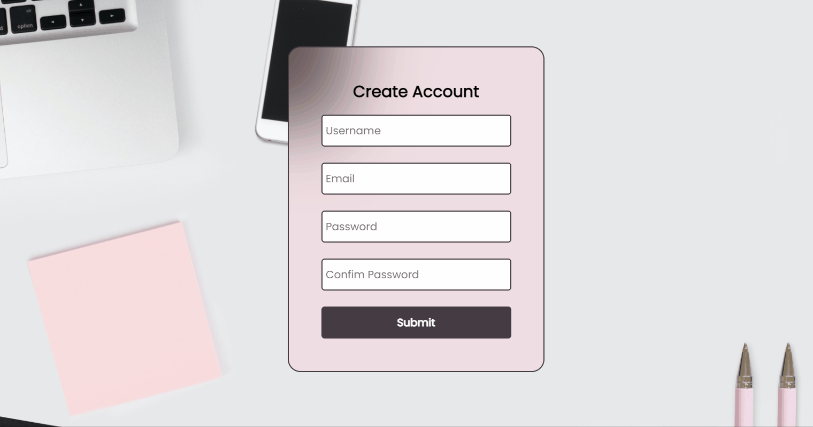

# Form with validation

## Preview screen form

---

## Preview screen form with errors

---

## Form running

---

> ### ✔️ Validations

- [x] User can not submit the form with some empty input;
- [x] User can not enter an invalid email;
- [x] User can not enter a passoword 8 or more digits;
- [x] Passwords must match.

> ### 💻 Technologies Used

- HTML
- CSS
- Jvascript

> ### ⚠️ Observation

This application contains only the form page with validation, if the form is filled out correctly, the message "Form is valid!" will be displayed in the browser console
